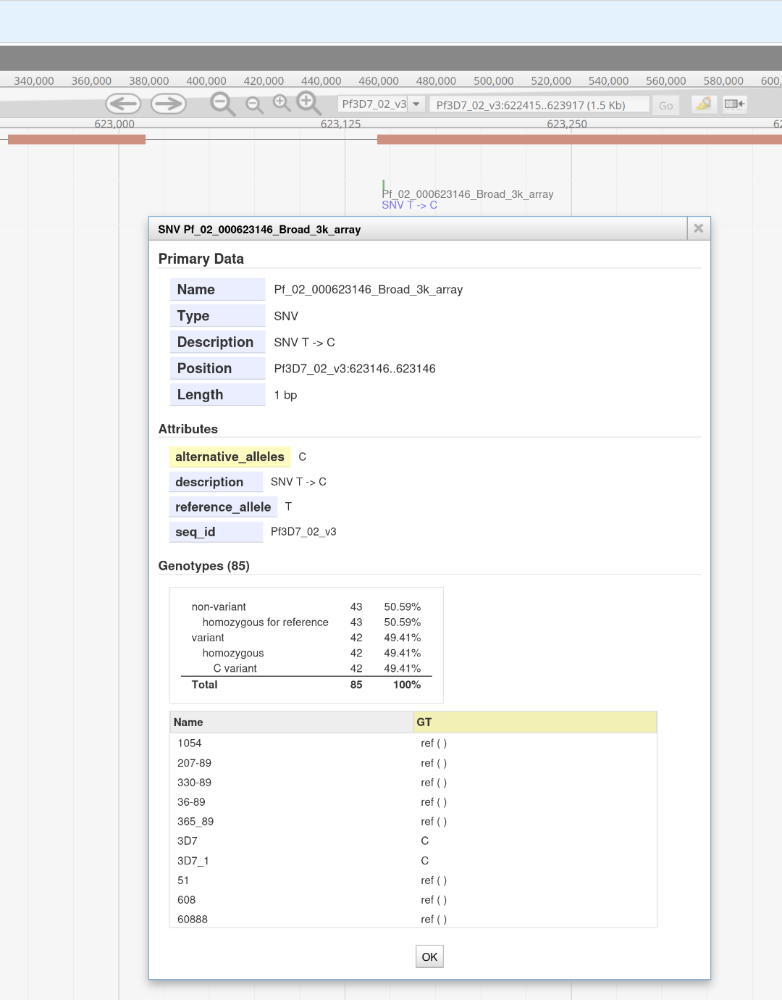

# Demos - veupathdb


## convertSnpCacheToVCF.pl [cachedSnpFile] [referencStrain]

Writes VCF to stdout!

Example:
```
convertSnpCacheToVCF.pl examples/isolateSNPs.cache 3D7 > output.vcf
```

Reformat a tab-delimited file of SNPs (from arrays) into a VCF file.
A vcf file could be made for each strain OR one file for the entire dataset.  For our purpose we'd want one file for the entire dataset with columns for each strain.  

[VCF specification](https://samtools.github.io/hts-specs/VCFv4.2.pdf)

To validate:
```
perl -MVCF -e validate output.vcf
```
Load output in JBrowse:
1. Zip and tabix
```
bgzip output.vcf # creates output.vcf.gz
tabix output.vcf.gz # creates output.vcf.gz.tbi
```
In [JBrowse](https://plasmodb.org/plasmo/app/jbrowse?data=%2Fa%2Fservice%2Fjbrowse%2Ftracks%2Fdefault&tracks=gene%2CVCF%2BTabix_output_2%2CSNPGenotyping&loc=Pf3D7_02_v3%3A622415..623917&highlight=), in the *Track* menu -> *Open track file or URL* -> *Local files*, upload *both* the .gz and .gz.tbi



TODO:
* Support gzipped input file
* Use GetOptions (GetOpt::Long) instead of ordered arguments
* Support diploid alleles
* Add more INFO data fields
* Create a generic writer package


